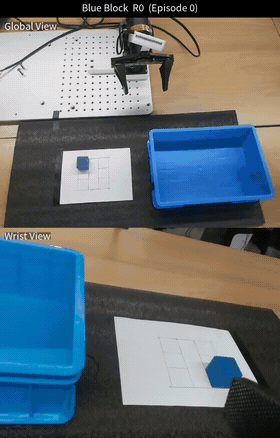
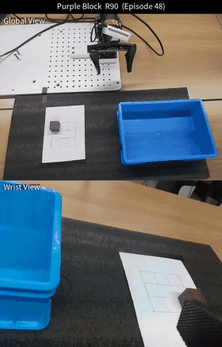

# Piper ACT Cube Grasp

End-to-end visuomotor cube grasping on the Piper 7-DoF arm, trained with [ACT](https://github.com/tonyzhaozh/act) (Action Chunking Transformer) via [LeRobot](https://github.com/huggingface/lerobot).

Dual-camera (wrist RealSense D435i + overhead USB), 64 demonstrations, 4 cube positions (2 colors × 2 rotations).

## Results

ACT policy successfully grasps cubes at all four positions after 100K training steps (ResNet-18 backbone, chunk size 100, 2× image augmentation).

<p align="center">
  
  
</p>

*Top: Global View (overhead USB camera). Bottom: Wrist View (RealSense D435i). 2× speed. Blue block R0° (left) and purple block R90° (right) — diagonal positions in the task grid.*

## Hardware

| Component | Model | Connection |
|---|---|---|
| Robot arm | Piper 7-DoF | CAN bus (can0) |
| Wrist camera | RealSense D435i | USB 3.0 |
| Global camera | USB SN0002 | USB |
| GPU | NVIDIA RTX 3060 12GB | PCIe |
| Teaching arm | Piper (mirror mode) | Shared CAN bus (can0) |

> **Mirror mode**: both arms share the same CAN bus. The teaching arm's motion is mirrored at the hardware level — no software forwarding needed. Data collection reads the follower arm state directly.

## Setup

### Conda environment

```bash
conda create -n lerobot_q python=3.10 -y
conda activate lerobot_q
pip install -r requirements.txt
```

Key dependencies: `lerobot >= 0.5.2`, `torch >= 2.0` (CUDA), `pyrealsense2`, `opencv-python`, `numpy < 2.0`.

### CAN bus

```bash
sudo bash scripts/setup_can.sh
# or manually:
sudo ip link set can0 down 2>/dev/null
sudo ip link set can0 up type can bitrate 1000000
```

### ROS 2 bridge (optional)

For the ROS → SDK bridge, source the ROS 2 workspace before launching:

```bash
source /opt/ros/humble/setup.bash
source /home/huatec/piper_py_ws/install/setup.bash
python3 launch/ros_sdk_bridge.launch.py allow_real_read:=true allow_real_write:=true
```

## Project structure

```
├── camera/                  RealSense D435i + USB camera driver (auto-detect)
├── hardware/                Piper SDK wrapper (safety limits, joint commands)
├── teleop/                  Data collection (LeRobot v3.0 format)
├── training/                ACT training scripts
├── inference/
│   ├── deploy.py            Real-robot deployment (approach + grasp pipeline)
│   └── eval_official_act.py Offline evaluation (MSE, per-episode)
├── ros_bridge/              ROS 2 bridge nodes (SDK → ROS topics → SDK)
├── launch/                  ROS 2 launch files
├── scripts/                 Utility scripts (CAN setup, camera preview, dataset prep)
├── configs/                 Training configs (official ACT, cube_64_dual)
├── data/
│   ├── cube_64_dual/        64-episode dual-cam dataset (167 MB)
│   └── single_cube_line4pos_40_clean/  40-episode single-cam dataset (124 MB)
├── outputs/train/           Training outputs & checkpoints
└── docs/                    Documentation & demo animations
```

## Workflow

### 1. Verify hardware

```bash
conda activate lerobot_q
python3 teleop/data_collector.py --list-cameras
bash scripts/view_cameras.sh          # dual-camera preview
```

### 2. Collect demonstrations

```bash
python3 teleop/data_collector.py --global-camera auto
```

| Key | Function |
|---|---|
| `E` | Enable follower arm |
| `Space` | Start / stop recording |
| `R` | Discard current episode |
| `Q` | Quit |

Manually return both arms to the start pose before each episode. Collect 15–20 episodes per cube position.

### 3. Train

```bash
# 64-episode dual-cam dataset (ResNet-18, d=256, chunk=100, 100K steps)
bash scripts/run_cube_blue_r0_d256.sh

# Official ACT on 40-episode single-cam dataset
bash training/train_official_act_single_cube_40.sh
```

Training configs are in `configs/`. Checkpoints are saved to `outputs/train/`.

### 4. Offline evaluation

```bash
python3 inference/eval_official_act.py \
    --checkpt outputs/train/act_cube_64_dual_d256/checkpoints/100000/pretrained_model
```

### 5. Deploy on real robot

```bash
# Full end-to-end (approach, close, lift, release)
bash scripts/run_official_act_full.sh
```

Or directly:

```bash
python3 inference/deploy.py \
    --policy-type act-full \
    --checkpt outputs/train/act_cube_64_dual_d256/checkpoints/100000/pretrained_model \
    --control-backend direct_sdk \
    --test-mode full-e2e \
    --allow-real-full-e2e
```

Press `Space` to execute one grasp attempt. `Q` to quit.

## Deployment safety

The `direct_sdk` backend has per-step delta limits, joint limits, stagnation detection, and norm safety flooring. All deployments require explicit `--allow-real-full-e2e`.

The ROS bridge path adds a secondary safety layer:
- `safety_gate_node` — validates & clips every raw action against joint/delta limits
- `piper_sdk_command_node` — applies configurable command scaling (default 20%), cumulative displacement guards, and oscillation detection
- All real-hardware flags (`--allow-real-read`, `--allow-real-write`, `--confirm-real-write`) default OFF

## Known fixes

- **LeRobot `feature_utils.py` patch** (v0.5.2): `ft["names"]` → `ft.get("names")` at line 153 of `lerobot/utils/feature_utils.py`. Video features in LeRobotDataset v3.0 lack a `names` field, causing training to crash.
- **NumPy < 2.0 required**: OpenCV is compiled against NumPy 1.x ABI. Install with `pip install "numpy<2"`.
- **PYTHONPATH isolation**: ROS 2's system Python path conflicts with conda. The conda env has activate/deactivate hooks in `~/miniconda3/envs/lerobot_q/etc/conda/` to clean PYTHONPATH.

## Citation

Built on [LeRobot](https://github.com/huggingface/lerobot) and [ACT](https://github.com/tonyzhaozh/act).
